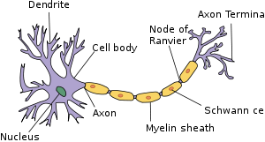

# Machine Learning

Today I started a classic Coursera course [Machine Learning by Andrew Ng](https://www.coursera.org/learn/machine-learning/home/welcome). I will update weekly about the topics introduced in the lectures and interesting problems I encountered. Here, I will just include a few bullet points from each week. Detailed summaries can be found in each week's README.md file. All diagrams were created from [draw.io](https://www.draw.io/), and all math notations were typed using inline html code or generated from [CodeCogs](http://latex.codecogs.com/).
## [Week 1](https://github.com/YuZhangIsCoding/ML_coursera/blob/master/Week1/README.md)
1. Introduction to Machine Learning
   * Popular ML algorithms
   * Supervised and unsupervised learning
2. Linear Regression with One Variable
   * Housing price
   
   
   
   * Hypothesis: h&theta;(x) = &theta;0 x + &theta;1x
   * Cost function: J(&theta;0, &theta;1) = 1&frasl;2m&sdot;&sum;(h&theta;(x(i))-y(i))2
   * Gradient descent
   * Learning rate &alpha;     
3. Linear Algebra
   * Matrix, vector
   * Matrix addition: same dimension, element-wise
   * Scalar multiplication: multiply by real number
   * Matrix-vector, matrix-matrix multiplication
   * Transpose: B = AT, then Bij = Aji
      
## [Week 2](https://github.com/YuZhangIsCoding/ML_coursera/blob/master/Week2/README.md)
1. Linear Regression with Multiple Variables
    * Often times we have multiple features (variables)
h&theta;(x) = &theta;0+&theta;1x1+&theta;2x2+...
    * The problem can be expressed as: h&theta;(x) = &theta;T&sdot;x

1. Gradient Descent for Multivariate Linear Regression
    * &theta;j := &theta;j-&alpha;&part;&frasl;&part;&theta;jJ(&theta;)
    * Feature Scaling: make sure that features are on a similar scale
    * Mean normalization: (xi-&mu;)/s
    * Learning rate: J(&theta;) should decrease after every iteration for sufficiently small &alpha;.
    * Features can be combined, e.g., combine frontage and depth to area.
    * Polynomial regression

1. Normal Equation: computing parameters analytically
    * &theta; = (XTX)-1XTy
    * Feature scaling is not needed
    * Noninvertibility (singular/degenerated)
        
1. Vectorization
    * Use matrix operations may reduce the computation times.
    * Wrap it all up, we can use this form for the matrix iterations: **&theta; = &theta;-&alpha;&frasl;m&sdot;XT&sdot;(X&sdot;&theta;-y)**
    * The cost function can also be vectorized: **J(&theta;) = 1&frasl;2m&sdot;(X&sdot;&theta;-y)T&sdot;(X&sdot;&theta;-y)**

## [Week 3](https://github.com/YuZhangIsCoding/ML_coursera/blob/master/Week3/README.md)

1. Classification and Representation
    * Logistic regression: idea is to use threshold classifier output h&theta;(x) at 0.5
    * Hypothesis representation **h&theta;(x) = 1&frasl;(1+e-&theta;T&sdot;x)**, and **h&theta;(x) = P(y=1|x;&theta;)**
    * Decision boundary - a property of hypothesis
    * Simplified cost function and gradient descent **J(&theta;) = -1&frasl;m[&sum;(ylog(h&theta;(x))+(1-y)log(1-h&theta;(x)))]**
    * Iterations: &theta;j := &theta;j-&alpha;&part;&frasl;&part;&theta;j(J(&theta;))
        
    * Vectorized implementation:
        
        **h&theta;(x) = g(X&sdot;&theta;)**
        
        **J(&theta;) = 1&frasl;m&sdot;(-yT&sdot;log(h)-(1-y)Tlog(1-h))**
        
        **&theta; = &theta;-&alpha;&frasl;m&sdot;XT&sdot;(g(X&sdot;&theta;)-y)**

    * Advanced optimization (Conjugate gradient, BFGS, L-BFGS)
    
1. Multicalss classification
    * one-vs-all
    
        
        
        **h&theta;(i)(x) = P(y=i|x;&theta;), (i = 1, 2, 3, ...)**, 
        and **max h&theta;(i)(x)**

1. Rugularization
   * The problem of overfitting
      
      
      
   * Addressing overfitting (Reduce number of features or Regularization)

   * Cost function:**J(&theta;) = 1&frasl;2m&sdot;[&sum;(h&theta;(x(i))-y(i))2+&lambda;&sdot;&sum;&theta;j2], *j = 1, 2, ..., n***
   * Regulalized linear regression
   
      **&theta;0 = &theta;0-&alpha;&frasl;m&sdot;&sum;(h&theta;(x)-y)&sdot;x0**
      
      **&theta;j = &theta;j-&alpha;&sdot;[1&frasl;m&sdot;&sum;(h&theta;(x)-y)&sdot;x0+&lambda;&frasl;m&sdot;&theta;j], *j = 1, 2, ..., n***
      
      }
   * Normal equation:
      **&theta; = (XT&sdot;X+&lambda;[011])-1&sdot;XT&sdot;y**
            
   * Regularized logistic regression:
      **J(&theta;) = -1&frasl;m&sdot;[&sum;(ylog(h&theta;(x))+(1-y)log(1-h&theta;(x)))]+&lambda;&frasl;2m&sdot;&sum;&theta;j2, *j = 1, 2, ..., n***
## [Week 4](https://github.com/YuZhangIsCoding/ML_coursera/blob/master/Week4/README.md)
1. Non-linear classification
    * Too many features in hypothesis, logistic regression suffers overfitting or large computational cost.
    * Computer vision: Car detection may result in millions of features if just include the quadratic features.

2. Neural networks: algorithms that try to mimic the brain
    * The "One learning algorithm" hypothesis: (Auditory cortex learns to see; Somatosensory cortex learns to see, etc)
    * Model representation
        * A [neuron](https://en.wikipedia.org/wiki/Neuron) is composed of nucleus, dendrites, axons, etc., where dendrites and axons serves as the "input wires" and "output wires", respectively.
        
            
        * Logistic unit can be built similarily on this neuron model:
           
             
        * Neural networks:

            
        * Forward propagation: just like logistic regressions, but do it on every layer
            
            z(2) = &Theta;(1)x

            a(2) = g(z(2))

            Add a0(2) = 1 &rarr; a(2) at this layer has n+1 features

            z(3) = &Theta;(2)a(2)

            ...
    * Examples: logic gates (AND, OR, NOT, (NOT A) AND (NOT B), XNOR, XOR)
    * Multiclass classification
        * Multiple output units: one-vs-all
        * Instead of output as discrete values such as y &isin; {1, 2, 3, ...}, we have y &isin; [[1;0;0;0],[0;1;0;0],[0;0;1;0], ...]

## [Week 5](https://github.com/YuZhangIsCoding/ML_coursera/blob/master/Week5/README.md)
1. Backpropagation

   * Cost function:
  
      

   * Gradients
      
      
      
      For the output unit:
      
      
      
      For inner layers:
      
      

   * Backpropagation intuition

      

   * Unrolling Parameters: Unroll the &Theta; matrices into the just one matrix and recover after backpropogation.

   * Gradient checking

       
    
   * Initial value of &Theta; Use random initialization for symmetry breaking.

   * Put it together
      * Pick a network architecture
      * Reasonable defaults: 1 hiddern layer or if >1 hidden layers, have same number of hidden units in every layer
      * Training a neural network
         1. Randomly initialize weights
         2. Implement forward propagation to get H&Theta;(xl) for each layer
         3. Compute cost function J(&Theta;)
         4. Implement backpropagation to compute partial derivatives
         5. Use gradient checking to compare partial derivaties compute using backpropagation vs. using numerical estimate of gradients
         6. Use gradient descent or advanced optimized method with backpropation to try to minimize J(&Theta;) as a function of parameters &Theta; (Notice that J(&Theta;) is non-convex, so we may end up finding a local minimum)
## Week 6
1. Spam Classifier

    Supervised learning
    
    x = features of email, e.g. deal, buy, discount, now, etc. In practice, take most frequently occuring n words (10,000 t0 50,000) in training set.

    y = spam (1) or not spam (0)

    * Advices to make your classifier have low error:
        * Collect lots of data, e.g. ["honey pot" project](https://en.wikipedia.org/wiki/Project_Honey_Pot).
        * Develop sophiscated features based on email routing infomation (email header).
        * Develop sophiscated features based on message bodies, e.g. distinguish synonyms, features about punctuations, etc.
        * Develop sophiscated algorithm to detect misspelling and improve input correctness.
    * Recommended approach
        * Start with a simple algorithm and test it on cross-validation data
        * Plot learning curve to decide if more data or more features needed, etc.
        * Error analysis: manually examine the examples that your algorithm made errors on. See if any systemetic trend of errors made.
    * Importance of numerical evaluation
        
        Should discount/discounts/discounted/discounting be taken as the same word? (Can be implemented by stemming softer, e.g. [porter stemmer](https://tartarus.org/martin/PorterStemmer/).

        Error analysis may not be helpful for deciding if this is likely to improve performance. Only solution is to try it and see if it works.

    * Error metrics for skewed classes
        
        Take the cancer classification as an example. Assume we find 1% error on test set, but the fact is that only 0.5% of patients have cancer. And if we have second classifier that always predicts the patients to be benign (y = 0), we will only have 0.5% error. But can we say that the second classifier is better?

        There's another example. Say an algorithm has 99.2% accuracy (0.8% error), and the other one has 99.5% accuracy (0.5% error), can we say the second is better?
    
    * Precision/Recall
    
        
        
        * Precision: of all patients where we predicted y = 1, what fraction actually has cancer?

        * Recall: of all patients who has cancer, what fraction did we correctly detect as having cancer? In the example above, if we always predict y = 0, then recall = 0.

    * Trading off precision and recall
        
        Take logistic regression for example, 0 &le; h&theta;(x) &le; 1

        Predict 1 if h&theta;(x) &ge; threshold
        
        Predict 0 if h&theta;(x) < threshold

        * Suppose we want to predict y = 1 only if very confidently, then we may raise the threshold (0.7, 0.9, etc.). Then we will have high precision, but low recall (missing cases actually are 1)

        * Suppos we want to avoid missing too many cases of y = 1 (avoid false nagatives), we could lower threshold. Then we will have high recall, but low precision (many cases not 1 will be included)

        

    * F1 Score (F score)

        
        
        How to compare precision/recall numbers?

        Algorithms|Precision|Recall|Average|F1 Score
        -|-|-|-
        Algo1|0.5|0.4|0.45|0.444
        Algo2|0.7|0.1|0.4|0.175
        Algo3|0.02|1.0|0.51|0.0392

        * Average is not good because it fails to exclude the cases when precison or recall is extremely low.

    * Data for Machine Learning
        
        When designing a high accuracy learning system, sometime there are a lot of algorithms we can choose from.

        E.g. classify between confusing words

        {to, too, two}, {then, than}, etc. For breakfast, I ate ____ eggs.

        For this problem we could have following choices:
            * [Perceptron](https://en.wikipedia.org/wiki/Perceptron)
            * [Winnow](https://en.wikipedia.org/wiki/Winnow_(algorithm))
            * [Memory-based](https://en.wikipedia.org/wiki/Instance-based_learning)
            * [Naive Bayes](https://en.wikipedia.org/wiki/Naive_Bayes_classifier)

    * Large Date Rationale
        
        Assume feature X &isin; Rn+1 has sufficient info to predict y accuracy
            
            Example: I ate (two) eggs.

            Counter example: Predicting housing price form only size and no other features

            Useful test: Given the input x, can human expert confidently predict y?
        
        Combine the strategies below will yield a small cost function Jtest(&theta;)
            1. Use a learning algorithm with many parameter (logisti/linear regression with many feature; neural network with many hidden layers), which gives low bias &rarr; Jtrain(&theta;) will be small
            2. Use large training set, which makes it unlikely to overfit &rarr; Jtrain(&theta;) &asymp; Jtest(&theta;)
