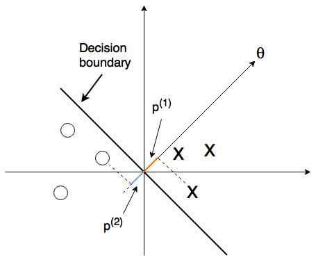
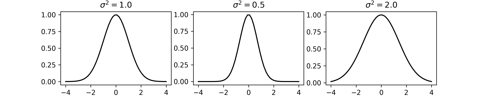

# Machine Learning

Today I started a classic Coursera course [Machine Learning by Andrew Ng](https://www.coursera.org/learn/machine-learning/home/welcome). I will update weekly about the topics introduced in the lectures and interesting problems I encountered. Here, I will just include a few bullet points from each week. Detailed summaries can be found in each week's README.md file. All diagrams were created from [draw.io](https://www.draw.io/), and all math notations were typed using inline html code or generated from [CodeCogs](http://latex.codecogs.com/).
## [Week 1](https://github.com/YuZhangIsCoding/ML_coursera/blob/master/Week1/README.md)
1. Introduction to Machine Learning
   * Popular ML algorithms
   * Supervised and unsupervised learning
2. Linear Regression with One Variable
   * Housing price
   
   
   
   * Hypothesis: h&theta;(x) = &theta;0 x + &theta;1x
   * Cost function: J(&theta;0, &theta;1) = 1&frasl;2m&sdot;&sum;(h&theta;(x(i))-y(i))2
   * Gradient descent
   * Learning rate &alpha;     
3. Linear Algebra
   * Matrix, vector
   * Matrix addition: same dimension, element-wise
   * Scalar multiplication: multiply by real number
   * Matrix-vector, matrix-matrix multiplication
   * Transpose: B = AT, then Bij = Aji
      
## [Week 2](https://github.com/YuZhangIsCoding/ML_coursera/blob/master/Week2/README.md)
1. Linear Regression with Multiple Variables
    * Often times we have multiple features (variables)
h&theta;(x) = &theta;0+&theta;1x1+&theta;2x2+...
    * The problem can be expressed as: h&theta;(x) = &theta;T&sdot;x

1. Gradient Descent for Multivariate Linear Regression
    * &theta;j := &theta;j-&alpha;&part;&frasl;&part;&theta;jJ(&theta;)
    * Feature Scaling: make sure that features are on a similar scale
    * Mean normalization: (xi-&mu;)/s
    * Learning rate: J(&theta;) should decrease after every iteration for sufficiently small &alpha;.
    * Features can be combined, e.g., combine frontage and depth to area.
    * Polynomial regression

1. Normal Equation: computing parameters analytically
    * &theta; = (XTX)-1XTy
    * Feature scaling is not needed
    * Noninvertibility (singular/degenerated)
        
1. Vectorization
    * Use matrix operations may reduce the computation times.
    * Wrap it all up, we can use this form for the matrix iterations: **&theta; = &theta;-&alpha;&frasl;m&sdot;XT&sdot;(X&sdot;&theta;-y)**
    * The cost function can also be vectorized: **J(&theta;) = 1&frasl;2m&sdot;(X&sdot;&theta;-y)T&sdot;(X&sdot;&theta;-y)**

## [Week 3](https://github.com/YuZhangIsCoding/ML_coursera/blob/master/Week3/README.md)

1. Classification and Representation
    * Logistic regression: idea is to use threshold classifier output h&theta;(x) at 0.5
    * Hypothesis representation **h&theta;(x) = 1&frasl;(1+e-&theta;T&sdot;x)**, and **h&theta;(x) = P(y=1|x;&theta;)**
    * Decision boundary - a property of hypothesis
    * Simplified cost function and gradient descent **J(&theta;) = -1&frasl;m[&sum;(ylog(h&theta;(x))+(1-y)log(1-h&theta;(x)))]**
    * Iterations: &theta;j := &theta;j-&alpha;&part;&frasl;&part;&theta;j(J(&theta;))
        
    * Vectorized implementation:
        
        **h&theta;(x) = g(X&sdot;&theta;)**
        
        **J(&theta;) = 1&frasl;m&sdot;(-yT&sdot;log(h)-(1-y)Tlog(1-h))**
        
        **&theta; = &theta;-&alpha;&frasl;m&sdot;XT&sdot;(g(X&sdot;&theta;)-y)**

    * Advanced optimization (Conjugate gradient, BFGS, L-BFGS)
    
1. Multicalss classification
    * one-vs-all
    
        
        
        **h&theta;(i)(x) = P(y=i|x;&theta;), (i = 1, 2, 3, ...)**, 
        and **max h&theta;(i)(x)**

1. Rugularization
   * The problem of overfitting
      
      
      
   * Addressing overfitting (Reduce number of features or Regularization)

   * Cost function:**J(&theta;) = 1&frasl;2m&sdot;[&sum;(h&theta;(x(i))-y(i))2+&lambda;&sdot;&sum;&theta;j2], *j = 1, 2, ..., n***
   * Regulalized linear regression
   
      **&theta;0 = &theta;0-&alpha;&frasl;m&sdot;&sum;(h&theta;(x)-y)&sdot;x0**
      
      **&theta;j = &theta;j-&alpha;&sdot;[1&frasl;m&sdot;&sum;(h&theta;(x)-y)&sdot;x0+&lambda;&frasl;m&sdot;&theta;j], *j = 1, 2, ..., n***
      
      }
   * Normal equation:
      **&theta; = (XT&sdot;X+&lambda;[011])-1&sdot;XT&sdot;y**
            
   * Regularized logistic regression:
      **J(&theta;) = -1&frasl;m&sdot;[&sum;(ylog(h&theta;(x))+(1-y)log(1-h&theta;(x)))]+&lambda;&frasl;2m&sdot;&sum;&theta;j2, *j = 1, 2, ..., n***
## [Week 4](https://github.com/YuZhangIsCoding/ML_coursera/blob/master/Week4/README.md)
1. Non-linear classification
    * Too many features in hypothesis, logistic regression suffers overfitting or large computational cost.
    * Computer vision: Car detection may result in millions of features if just include the quadratic features.

2. Neural networks: algorithms that try to mimic the brain
    * The "One learning algorithm" hypothesis: (Auditory cortex learns to see; Somatosensory cortex learns to see, etc)
    * Model representation
        * A [neuron](https://en.wikipedia.org/wiki/Neuron) is composed of nucleus, dendrites, axons, etc., where dendrites and axons serves as the "input wires" and "output wires", respectively.
        
            
        * Logistic unit can be built similarily on this neuron model:
           
             
        * Neural networks:

            
        * Forward propagation: just like logistic regressions, but do it on every layer
            
            z(2) = &Theta;(1)x

            a(2) = g(z(2))

            Add a0(2) = 1 &rarr; a(2) at this layer has n+1 features

            z(3) = &Theta;(2)a(2)

            ...
    * Examples: logic gates (AND, OR, NOT, (NOT A) AND (NOT B), XNOR, XOR)
    * Multiclass classification
        * Multiple output units: one-vs-all
        * Instead of output as discrete values such as y &isin; {1, 2, 3, ...}, we have y &isin; [[1;0;0;0],[0;1;0;0],[0;0;1;0], ...]

## [Week 5](https://github.com/YuZhangIsCoding/ML_coursera/blob/master/Week5/README.md)
1. Backpropagation

   * Cost function:
  
      

   * Gradients
      
      
      
      For the output unit:
      
      
      
      For inner layers:
      
      

   * Backpropagation intuition

      

   * Unrolling Parameters: Unroll the &Theta; matrices into the just one matrix and recover after backpropogation.

   * Gradient checking

       
    
   * Initial value of &Theta; Use random initialization for symmetry breaking.

   * Put it together
      * Pick a network architecture
      * Reasonable defaults: 1 hiddern layer or if >1 hidden layers, have same number of hidden units in every layer
      * Training a neural network
         1. Randomly initialize weights
         2. Implement forward propagation to get H&Theta;(xl) for each layer
         3. Compute cost function J(&Theta;)
         4. Implement backpropagation to compute partial derivatives
         5. Use gradient checking to compare partial derivaties compute using backpropagation vs. using numerical estimate of gradients
         6. Use gradient descent or advanced optimized method with backpropation to try to minimize J(&Theta;) as a function of parameters &Theta; (Notice that J(&Theta;) is non-convex, so we may end up finding a local minimum)
## [Week 6](https://github.com/YuZhangIsCoding/ML_coursera/blob/master/Week6/README.md)
1. Debugging a learning algorithm
    * If found unacceptable large errors in its prediction, try these:
        1. Get more training examples &rarr; fixes high variance
        2. Try smaller sets of features &rarr; fixes high variance
        3. Try additional features &rarr; fiexes high bias
        4. Try adding polynomial features &rarr; fixes high bias
        5. Try descreasing &lambda; &rarr; fixes high bias
        6. Try increasing &lambda; &rarr; fixes high variance
    * Evaluate a hypothesis
        
        * Split data set to 2 sets: 70% training set and 30% test set are common defaults many people uses
        * Learn parameter &theta; from training data (minimize training error Jtrain(&theta;))
        * Compute test set error Jtest(&theta;)

    * Model selection
        * Instead of dividing into just 2 data sets, we can split the data into 3 sets: 60% training set, 20% cross-validation set and 20% test set, which are common defaults many people use
        * Learn parameter &theta; and obtain training error
        * Calculate cross-validation error
        * Pick model from cross-validation step and calculate test error

    * Bias vs. Variance
    
             
        
        * High bias: underfitting, Jtest(&theta;) &asymp; Jtrain(&theta;)
        * High variance: overfitting, Jtrain(&theta;) will be low and Jcv(&theta;) >> Jtrain(&theta;)

    * Regularization and Bias/Variance: Bias/Variance as a function of regularization parameter &lambda;

        

    * Learning curves: training/cross-validation error as a function of training size
        
        * High bias: training error will be closer to the cross-validation error, and getting more data will not help too much
            
            

        * High variance: training error is much lower than cross-validation error, and getting more data is likely to help

            

    * Neural Network and overfitting
        * "Small" neural network (fewer features), computationally cheaper, but more prone to underfitting
        * "Large" neural network (more parameters), computationally more expensive, more prone to overfitting, use regularization to address overfitting.

1. Spam Classifier
    * Advices to make your classifier have low error:
        * Collect lots of data, e.g. ["honey pot" project](https://en.wikipedia.org/wiki/Project_Honey_Pot).
        * Develop sophiscated features based on email routing infomation (email header).
        * Develop sophiscated features based on message bodies, e.g. distinguish synonyms, features about punctuations, etc.
        * Develop sophiscated algorithm to detect misspelling and improve input correctness.
    * Recommended approach
        * Start with a simple algorithm and test it on cross-validation data
        * Plot learning curve to decide if more data or more features needed, etc.
        * Error analysis: manually examine the examples that your algorithm made errors on. See if any systemetic trend of errors made.
    * Precision/Recall
    
        

    * Trading off precision and recall

        

    * F1 Score (F score)
        
        
    
    * Data for Machine Learning
        
        > "It's not who has the best algorithm that wins. It's who has the most data."

    * Large Date Rationale
        
         1. Use a learning algorithm with many parameter (logisti/linear regression with many feature; neural network with many hidden layers), which gives low bias &rarr; Jtrain(&theta;) will be small
         2. Use large training set, which makes it unlikely to overfit &rarr; Jtrain(&theta;) &asymp; Jtest(&theta;)
## [Week 7](https://github.com/YuZhangIsCoding/ML_coursera/blob/master/Week7/README.md)
1. Support Vector Machine (Large Margin Classifier)
    * Alternative view of logistic regression
        We can build cost function as following:

        

        Where C acts like 1&frasl;&lambda; in the logistic regression, and Cost1(z) and Cost0(z) look like below:

        

        And the hypothesis is:

        *h&theta;(x) = 1, if &theta;Tx &ge; 0*
        
        *h&theta;(x) = 0, otherwise*

    * Large Margin Intuition

        **minimize 1/2&sum;&theta;j2**

        such that

        **&theta;Tx(i) &ge; 1, if y(i) = 1**

        **&theta;Tx(i) &le; -1, if y(i) = 0**

    * SVM decision boundary
        * Linearly separable case
            
            

            Mathematically SVM select model with large margins

        * In presence of outliers

            

    * The math behind SVM

        * Vector inner product

            

            Thus uT&sdot;v = u1v1+u2v2 = p&sdot;||u||

        * SVM decision boundary: p(i)&sdot;||&theta;|| &ge; 1 or p(i)&sdot;||&theta;|| &le; -1

            minimize 1/2&sum;&theta;j2 = 1/2||&theta;||2

            And larger margin can decrease ||&theta;||

            
            

2. Kernels
    * Kernel: fi = Similarity(x, l(i)), i = 1, ..., m
   
        
        
    * Gaussian Kernal (RBF kernel): If x &asymp; l(i), f &asymp; 1; if x is far from l(i), f &asymp; 0
   
        
        
        
      
    * Choose landmarks: 
        
        Given (x(1), y(1)), ..., (x(m), y(m)), 
        
        Choose l(1) = x(1), ..., l(m) = x(m)
        
        Compute fi(j) = Similarity(x(j), l(i)), where i, j = 1, ..., m
      
    * SVM parameters
   
        * C (1&frasl;&lambda;)
           
           Large C: lower bias, high variance
           
           Small C: higher bias, low variance
        * &sigma;2
           
           Large &sigma;2: features f vary more smoothly &rarr; higher bias, low variance
           
           Small &sigma;2: features f vary less smoothly &rarr; lower bias, high variance
   
    * Choices of kernel
      
        * No kernel ("linear kernel"): n is large and m is small
      
        * Gaussian kernel: n is small and/or m is large; need to choose appropriate  &sigma;2; feature scaling before using Gaussian kernel
      
        * Other choices: [Polynomial kernel](https://en.wikipedia.org/wiki/Polynomial_kernel); [String kernel](https://en.wikipedia.org/wiki/String_kernel); [chi-square kernel](https://en.wikipedia.org/wiki/Chi-squared_distribution); [histogram intersection kernel](http://ieeexplore.ieee.org/document/1247294/)
    * Multiclass Classification: Builtin or one-vs-all
    * Logistic Regression vs. SVM

        * If n is large: logistic regression or SVM without a kernel
        * If n is small, m is intermediate: SVM with Gaussian Kernel
        * If n is small, m is large: Create/add more features, then use logistic regression or SVM without a kernel

        Neural Network likely to work well for most of these settings, but maybe slow to train.
   
## [Week 8](https://github.com/YuZhangIsCoding/ML_coursera/blob/master/Week8/README.md)
1. Clustering
    * Unsupervised learning

        

    * Optimization objective

        

    * K-means algorithm
        
        

        **Randomly initialize K cluster centroids: randomly pick K (K < m) traning examples and set &mu;1, ..., &mu;K to these K examples.**

        **Repeat{**

        **for i = 1 to m**
        
        &nbsp;&nbsp;&nbsp;&nbsp;**C(i) = index (from 1 to K) of cluster cnetroid closest to x(i)** &larr; *Cluster assignment step* &rarr; minimize J(...) with respect to C(1), ..., C(m), while holding &mu;1, ..., &mu;K fixed

        **for k = 1 to K**

        &nbsp;&nbsp;&nbsp;&nbsp;**&mu;k = average of points assigned to cluster k** &larr; *Move centroid step* &rarr; minimize J(...) with respect to &mu;1, ..., &mu;K

        **}**

        * *Note: if no sample assigned to a centroid, we can*

            1. *Delete that centroid, and decrease the number of centroids to K-1 (more common).*
    
            2. *Randomly reinitialize the centroid if need K clusters.*

    * Local optima: try initializing several different times and **pick clustering that gives lowest cost function J(...)**

        * K = 2-10, random initialization works pretty well

        * K >> 10, just slight improve after random initialization

    * Choosing the number of clusters: 

        * Mainly by hand, human judgement
            
        * Elbow method: plot cost function vs. K

            

            "Worth a shot, but won't have a high expectation", because many times, there are no clear elbow.

        * Later/downstream purpose

2. Dimensionality Reduction: Principal Component Analysis (PCA)
    * Motivation
        * Data compression: reduce data from 2D to 1D if datas fall near a line, or reduce data from 3D to 2D if data falls near a plane, etc.
            

        * Data visualization: simplify the features to 2 or 3 most comprehensive and important features
    * PCA problem formulation: Reduce from n-dimension to K-dimension:

        Find K vectors u(1), ..., u(K) onto which to project the data, so as to minimize the projection error.

    * PCA is not linear regression: **Linear regression minimizes vetical distances, while PCA minimizes orthogonal distances, where data is not labeled and treated equally**

        

    * PCA algorithm with vectorized implementation
        
        **After mean normalization and feature scaling**

        **Compute ["Covariance matrix"](https://en.wikipedia.org/wiki/Covariance_matrix): &sum; = 1&frasl;m&sdot;XT&sdot;X**

        **Compute "eigenvectors" of matrix &sum;: [U, S, V] = svd(&sum;)**

        **Select first K eigenvectors as Ureduce: Ureduce = U(:, 1:K)**

        **Compute the projection from X to Z: Z = X&sdot;Ureduce**

    * Reconstruction from compressed representation: **Xapprox = Z&sdot;Ureduce**

    * Choose the number of pricinple components: choose K to be the smallest value, so that **"99% of variance is retained"**

        &nbsp;&nbsp;&nbsp;&nbsp;

    * Choose K algorithm:
        
        **Try PCA with K = 1, 2, ...**

        **Compute [U, S, V] = svd(&sum;)**

        **Pick the smallest K that satisfies:**
            
        &nbsp;&nbsp;&nbsp;&nbsp;

    * Application of PCA: *speed up supervised learning*, *reduce memory/disk needed to store data*, *visualization with K = 2 or 3*
        
    * Bad use of PCA: prevent overfitting, blindly use PCA without testing raw data
