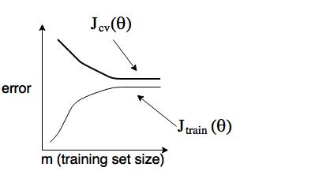

## Week 10

1. Learning With Large Datasets

    * Perform sanity check (learning curve) before building algorithm for large dataset

        If the algorithm suffers from large variance, adding more datasets are likely to help

        

        If the algorithm suffers from large bias, we may want to create more features before increase the datasets

        

    * Stochastic Gradient Descent

        Take linear regression as an example,

        Define:

        &nbsp;&nbsp;&nbsp;&nbsp;

        And the cost function can be expressed as:

        &nbsp;&nbsp;&nbsp;&nbsp;

        * Algorithm

            Randomly shuffle datasets

            Repeat{    &larr; 1-10 times

            &nbsp;&nbsp;&nbsp;&nbsp;for i = 1, ..., m {

            &nbsp;&nbsp;&nbsp;&nbsp;&nbsp;&nbsp;&nbsp;&nbsp;

            &nbsp;&nbsp;&nbsp;&nbsp;}

            }

        Batch gradient descent will move directly to global minimum, but stochastic gradient descent will move in some region near the global minimum.

    * Mini-Batch Gradient Descent

        Use b examples in each iteration.

        * Algorithm:

            Repeat{

            &nbsp;&nbsp;&nbsp;&nbsp;for i = 1, 1+b ..., m-b+1 {

            &nbsp;&nbsp;&nbsp;&nbsp;&nbsp;&nbsp;&nbsp;&nbsp;

            &nbsp;&nbsp;&nbsp;&nbsp;}

            }

    * Checking for convergence

        For batch gradient descent, we could plot J(&theta;) as a function of number of iterations.

        For stochastic gradient descent, plot Cost(&theta;, (x(i), y(i))) averaged over the last 1000 examples processed by algorithm.
        
        

        Learning rate is typically hold constan, but we can also slowly decrease &alpha; over time if we want &theta; to converge. E.g.

        
        
1. Online Learning

    * Examples:
    
        Optimize shipping price, product search (Predicted [CTR](https://en.wikipedia.org/wiki/Click-through_rate)), choose special offers, news articles, production recommendations, etc.

    * Algorithm
    
        Repeat forever{
        
        &nbsp;&nbsp;&nbsp;&nbsp;Get(x, y) corresponding to user
        
        &nbsp;&nbsp;&nbsp;&nbsp;Update &theta; using (x, y):
        
        &nbsp;&nbsp;&nbsp;&nbsp;&nbsp;&nbsp;&nbsp;&nbsp;
        
        }

1. Map Reduce and Data Parallelism
    
    Many learning algorithms can be expressed as computing sums of functions over the training set
    
    Use multiple machines or a multi-core machine to split the training set and use a node to combine results.
