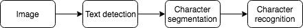

## Week 11

1. Photo Optical Character Recognition(OCR)
    1. Text detection
    2. Character segmentation
    3. Character classification
    
    * Pipeline

        

    * Sliding window: supervised learning

        * Use 2D sliding window for text detection

        * Use 1D sliding window for character segmentation

    * Getting lots of data: artifact data

        1. Create data from scratch

        2. Synthesis data by introducing distortioins
            
            * Distortion introduced should be representative of the type of noise/distortion in the test set
            * Adding random/meaningless noise usually does not help

    * Advice for getting lots of data

        1. Make sure have a low bias classifier before expanding the effort (draw learning curve, keep increasing the number of features/number of hidden units until you have a low bias classifier)

        2. "How much work would it be to get 10&times; as much data as we currently have"

            * Artificial data synthesis
            * Collect/label it yourself
            * "Crowd source" ([Amazon Mechanical Turk](https://www.mturk.com/))

    * Ceiling Analysis: estimate the errors due to each component

        "What part of the pipeline should you spend the most time trying to improve"

        For example, we have the following OCR system

        Component|Accuracy|Improvement
        -|-|-
        Overall system|72%|&nbsp;
        Text detection|89%|17%
        Character segmentation|90%|1%
        Character segmentation|100%|10%

        In this example, improving the test detection will have a relatively big improvement for the system.

