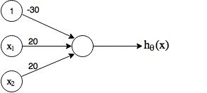
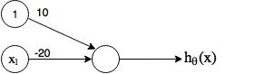
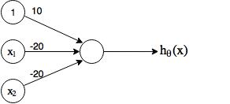
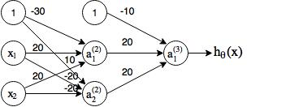
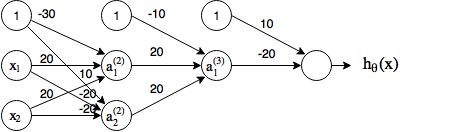

## Week 4
1. Non-linear classification
    * Previously we've successfully used logistic regression for classifications, but often times, we may have many features in our hypothesis. E.g. suppose we have x1, ..., xn features.
        * Just including the quadratic terms (x12, x1x2, ...) will have complexity of O(n2) &asymp; n2&frasl;2
        * Adding the cubic terms will make it O(n3) ...
        * Including all these my end up overfitting, and computationally expensive.
        * If we use less features, like just using x12, x22, ... may not represent well.
    * Computer vision: Car detection
        * Pick two blocks of pixels and input learning algorithms, so that we can detect cars from new input.
        * Assume that a block has 50&times;50 pixels, then totally there will be 2500 pixels (7500 RGB)
        * Then if we just the quadratic features for logistic regression will need &asymp; 3 million features

2. Neural networks: algorithms that try to mimic the brain
    * The "One learning algorithm" hypothesis
    
        From neuron science, researches have shown that
        1. Auditory cortex can learn to see if cut off audio input and replace with visual input.[1](https://www.nature.com/articles/35009102)
        2. Somatosensory cortex learns to see.
    * Model representation
        * A [neuron](https://en.wikipedia.org/wiki/Neuron) is composed of nucleus, dendrites, axons, etc., where dendrites and axons serves as the "input wires" and "output wires", respectively.
        
            
        * Logistic unit can be built similarily on this neuron model:
           
             
        * Neural networks:

            
            
            a1(2) = g(&theta;10(1)x0+&theta;11(1)x1+&theta;12(1)x2+&theta;13(1)x3)

            a2(2) = g(&theta;20(1)x0+&theta;21(1)x1+&theta;22(1)x2+&theta;23(1)x3)

            a3(2) = g(&theta;30(1)x0+&theta;31(1)x1+&theta;32(1)x2+&theta;33(1)x3)
            
            If network has sj units in layer j, sj+1 units in layer j+1, then &theta;(j) will have the dimension of sj+1&times;(sj+1).
    
            Output nodes will not include the bias nodes while the inputs will.
        * Mathematical representation: just like logistic regressions, but do it on every layer
            
            a1(2) = g(z1(2))

            a2(2) = g(z2(2))

            a3(2) = g(z3(2))
        * Forward propagation: vectorized implementation
            
            z(2) = &Theta;(1)x

            a(2) = g(z(2))

            Add a0(2) = 1 &rarr; a(2) at this layer has n+1 features

            z(3) = &Theta;(2)a(2)

            ...
    * Examples: logic gate

        x1, x2 &isin; {0, 1}, we have following logic operations:
        * AND
            
            
            
            h&theta;(x) = g(-30+20x1+20x2)

            x1|x2|h&theta;(x)
            --|--|--
            0|0|g(-30)&asymp;0
            0|1|g(-10)&asymp;0
            1|0|g(-10)&asymp;0
            1|1|g(10)&asymp;1

        * OR
        
            
            
            h&theta;(x) = g(-10+20x1+20x2)

            x1|x2|h&theta;(x)
            --|--|--
            0|0|g(-10)&asymp;0
            0|1|g(10)&asymp;1
            1|0|g(10)&asymp;1
            1|1|g(10)&asymp;1

        * NOT
            
            
            
            h&theta;(x) = g(10-20x1)

            x1|h&theta;(x)
            --|--
            0|g(10)&asymp;1
            1|g(-10)&asymp;0

        * (NOT x1) AND (NOT x2)

            
            
            h&theta;(x) = g(10-20x1-20x2)

            x1|x2|h&theta;(x)
            --|--|--
            0|0|g(10)&asymp;1
            0|1|g(-10)&asymp;0
            1|0|g(-10)&asymp;0
            1|1|g(-30)&asymp;0

        * XNOR (equals (x1 AND x2) OR ((NOT x1) AND (NOT x2))
        
            
            
            a1(2) = g(-30+20x1+20x2)

            a2(2) = g(10-20x1-20x2)

            h&theta;(x) = g(-10+20a1(2)+20a2(2))

            x1|x2|a1(2)|a2(2)|h&theta;(x)
            --|--|--|--|--
            0|0|g(-30)&asymp;0|g(10)&asymp;1|g(10)&asymp;1
            0|1|g(-10)&asymp;0|g(-10)&asymp;0|g(-10)&asymp;0
            1|0|g(-10)&asymp;0|g(-10)&asymp;0|g(-10)&asymp;0
            1|1|g(10)&asymp;1|g(-30)&asymp;0|g(10)&asymp;1
            
        * XOR (equals (x1 AND (NOT x2)) OR ((NOT x1) AND x2), another form (x1 OR x2) AND ((NOT x1) OR (NOT x2)))
            
            Build based on XNOR:
        
            
        
            a1(2) = g(-30+20x1+20x2)
            
            a2(2) = g(10-20x1-20x2)
            
            a1(3) = g(-10+20a1(2)+20a2(2))
            
            h&theta;(x) =  g(10-20a1(3))
    * Multiclass classification
        * Multiple output units: one-vs-all
        * Instead of output as discrete values such as y &isin; {1, 2, 3, ...}, we have y &isin; [[1;0;0;0],[0;1;0;0],[0;0;1;0], ...]
