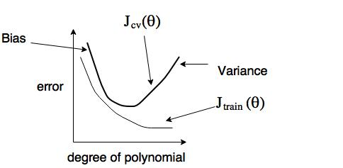
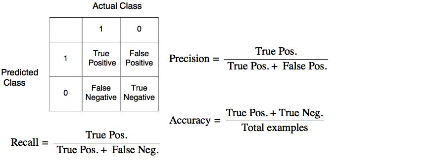

## Week 6
1. Debugging a learning algorithm
    * If found unacceptable large errors in its prediction, try these:
        1. Get more training examples &rarr; fixes high variance
        2. Try smaller sets of features &rarr; fixes high variance
        3. Try additional features &rarr; fiexes high bias
        4. Try adding polynomial features &rarr; fixes high bias
        5. Try descreasing &lambda; &rarr; fixes high bias
        6. Try increasing &lambda; &rarr; fixes high variance
    * Machine Learning Diagnostic
        
        A test that you can run to gain insight what is/isn't working with a learning algorithm, and gain guidance as to hwo best to improve its performance
    * Evaluate a hypothesis
        
        * Split data set to 2 sets: 70% training set and 30% test set are common defaults many people uses
        * Learn parameter &theta; from training data (minimize training error Jtrain(&theta;))
        * Compute test set error Jtest(&theta;)

    * Model selection

        Suppose we have a bunch of polynomial model to select, let d = degree of polynomial
        
        d = 1, h&theta;(x) = &theta;0+&theta;1x &rarr; &theta;(1) &rarr; Jtest(&theta;(1))
        
        d = 2, h&theta;(x) = &theta;0+&theta;1x+&theta;2x2 &rarr; &theta;(2) &rarr; Jtest(&theta;(2))
        
        .
        
        .
        
        .
        
        d = 10, h&theta;(x) = &theta;0+&theta;1x+...+&theta;10x10 &rarr; &theta;(10) &rarr; Jtest(&theta;(10))

        And choose Jtest(&theta;(5))

        * Jtest(&theta;(5)) is likely to be an optimistic estimate of generalization error, because extra parameter (d in this case) is fitted to test set.
        * **Instead of dividing into just 2 data sets, we can split the data into 3 sets: 60% training set, 20% cross-validation set and 20% test set, which are common defaults many people use**
        * Learn parameter &theta; and obtain training error
        * Calculate cross-validation error
        * Pick model from cross-validation step and calculate test error

    * Bias vs. Variance
    
             
        
        * High bias: underfitting, Jtest(&theta;) &aymp; Jtrain(&theta;)
        * High variance: overfitting, Jtrain(&theta;) will be low and Jcv(&theta;) >> Jtrain(&theta;)

    * Regularization and Bias/Variance: Bias/Variance as a function of regularization parameter &lambda;

        

    * Learning curves: training/cross-validation error as a function of training size
        
        
        
        * High bias: training error will be closer to the cross-validation error

            **If a learning algorithm is suffering from high bias, getting more training data will not (by itself) help too much**
            
            

        * High variance: training error is much lower than cross-validation error

            **If a learning algorithm is suffering from high variance, get more data is likely to help**

            

    * Neural Network and overfitting
        * "Small" neural network (fewer features), computationally cheaper, but more prone to underfitting
        * "Large" neural network (more parameters), computationally more expensive, more prone to overfitting, use regularization to address overfitting.

1. Spam Classifier

    Supervised learning
    
    x = features of email, e.g. deal, buy, discount, now, etc. 
    
    In practice, take most frequently occuring n words (10,000 t0 50,000) in training set.

    y = spam (1) or not spam (0)

    * Advices to make your classifier have low error:
        * Collect lots of data, e.g. ["honey pot" project](https://en.wikipedia.org/wiki/Project_Honey_Pot).
        * Develop sophiscated features based on email routing infomation (email header).
        * Develop sophiscated features based on message bodies, e.g. distinguish synonyms, features about punctuations, etc.
        * Develop sophiscated algorithm to detect misspelling and improve input correctness.
    * Recommended approach
        * Start with a simple algorithm and test it on cross-validation data
        * Plot learning curve to decide if more data or more features needed, etc.
        * Error analysis: manually examine the examples that your algorithm made errors on. See if any systemetic trend of errors made.
    * Importance of numerical evaluation
        
        Should discount/discounts/discounted/discounting be taken as the same word? (Can be implemented by stemming softer, e.g. [porter stemmer](https://tartarus.org/martin/PorterStemmer/)).

        Error analysis may not be helpful for deciding if this is likely to improve performance. Only solution is to try it and see if it works.

    * Error metrics for skewed classes
        
        Take the cancer classification as an example. Assume we find 1% error on test set, but the fact is that only 0.5% of patients have cancer. And if we have second classifier that always predicts the patients to be benign (y = 0), we will only have 0.5% error. But can we say that the second classifier is better?

        There's another example. Say an algorithm has 99.2% accuracy (0.8% error), and the other one has 99.5% accuracy (0.5% error), can we say the second is better?
    
    * Precision/Recall
    
        
        
        * Precision: of all patients where we predicted y = 1, what fraction actually has cancer?

        * Recall: of all patients who has cancer, what fraction did we correctly detect as having cancer? In the example above, if we always predict y = 0, then recall = 0.

    * Trading off precision and recall
        
        Take logistic regression for example, 0 &le; h&theta;(x) &le; 1

        Predict 1 if h&theta;(x) &ge; threshold
        
        Predict 0 if h&theta;(x) < threshold

        * Suppose we want to predict y = 1 only if very confidently, then we may raise the threshold (0.7, 0.9, etc.). Then we will have high precision, but low recall (missing cases actually are 1)

        * Suppos we want to avoid missing too many cases of y = 1 (avoid false nagatives), we could lower threshold. Then we will have high recall, but low precision (many cases not 1 will be included)

        

    * F1 Score (F score)
        
        
    
        How to compare precision/recall numbers?
        
        Algorithms|Precision|Recall|Average|F1 Score
        -|-|-|-|-
        Algo1|0.5|0.4|0.45|0.444
        Algo2|0.7|0.1|0.4|0.175
        Algo3|0.02|1.0|0.51|0.0392

        * Average is not good because it fails to exclude the cases when precision or recall is extremely low.        
    * Data for Machine Learning
        
        When designing a high accuracy learning system, sometime there are a lot of algorithms we can choose from.

        E.g. classify between confusing words

        {to, too, two}, {then, than}, etc. For breakfast, I ate ____ eggs.

        For this problem we could have following choices:
        
         * [Perceptron](https://en.wikipedia.org/wiki/Perceptron)
         * [Winnow](https://en.wikipedia.org/wiki/Winnow_(algorithm))
         * [Memory-based](https://en.wikipedia.org/wiki/Instance-based_learning)
         * [Naive Bayes](https://en.wikipedia.org/wiki/Naive_Bayes_classifier)
         
        When applying these algorithms to a large data set, the actual performance is similar.
        
        > "It's not who has the best algorithm that wins. 
        >
        > It's who has the most data."

    * Large Date Rationale
        
        Assume feature x &isin; Rn+1 has sufficient info to predict y accuracy
            
          Example: I ate (two) eggs.

          Counter example: Predicting housing price form only size and no other features

          Useful test: Given the input x, can human expert confidently predict y?
        
        Combine the strategies below will yield a small cost function Jtest(&theta;)
        
         1. Use a learning algorithm with many parameter (logisti/linear regression with many feature; neural network with many hidden layers), which gives low bias &rarr; Jtrain(&theta;) will be small
         2. Use large training set, which makes it unlikely to overfit &rarr; Jtrain(&theta;) &asymp; Jtest(&theta;)
