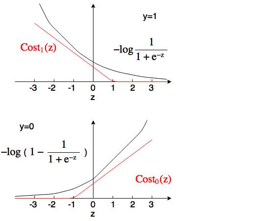

## Week 7
1. Support Vector Machine (Large Margin Classifier)
    * Alternative view of logistic regression
    
        
        
        If y = 1, we want h&theta;(x) &asymp; 1 &rarr; &theta;Tx >> 0
        
        If y =0, we want h&theta;(x) &asymp; 0 &rarr; &theta;Tx << 0

        We can build cost function as following:

        

        Where C acts like 1&frasl;&lambda; in the logistic regression, and Cost1(z) and Cost0(z) look like below:

        

        And the hypothesis is:

        *h&theta;(x) = 1, if &theta;Tx &ge; 0*
        
        *h&theta;(x) = 0, otherwise*

    * Large Margin Intuition

        Suppose we have a very large C, e.g. C = 100,000, then

        If y = 1, we want &theta;Tx &ge; 1 (not just &ge; 0)
        
        If y = 0, we want &theta;Tx &le; -1 (not just < 0)

        Thus, whenever y(i) = 1, the first term in the cost function equals C&times;(1&times;0+0&times;Cost0) = 0

        And if y(i) = 0, we also have C&times;(0&times;Cost1+1&times0) = 0

        Then our objective function is to 

        **minimize 1/2&sum;&theta;j2**

        such that

        **&theta;Tx(i) &ge; 1, if y(i) = 1**

        **&theta;Tx(i) &le; -1, if y(i) = 0**

    * SVM decision boundary
        * Linearly separable case
            
            

            Mathematically SVM select model with large margins

        * In presence of outliers

            

    * The math behind SVM

        * Vector inner product

            Let u = [u1; u2], v = [v1; v2]

            Define ||u|| = length of vector = &radic;(u12+u22)

            and p is the length of the vector onto u (signed), as illustrated below:

            

            Thus uT&sdot;v = u1v1+u2v2 = p&sdot;||u||

        * SVM decision boundary

            Let's simplify this problem to n = 2, and set &theta;0 = 0

            And the object function is to 

            minimize 1/2&sum;&theta;j2 = 1/2(&theta;12+&theta;22) = 1/2||&theta;||2

            Such that when C is very large:

            &theta;Tx(i) = p(i)&sdot;||&theta;|| &ge; 1, if y(i) = 1

            &theta;Tx(i) = p(i)&sdot;||&theta;|| &le; -1, if y(i) = 0

            As illustrated in the fig below, the vector of &theta; is perpendicular to the decision boundary.

            

            If y(i) = 1, then we need p(i)&sdot;||&theta;|| &ge; 1. If p(i) is small, then need ||&theta;|| to be large, which goes against our obejective.

            Same thing for y(i) = 0, and we need p(i)&sdot;||&theta;|| &le; -1. If p(i) is close to 0, then need ||&theta;|| to be large.

            And in this following case, since the margin is large, ||&theta;|| can be smaller.

            

2. Kernels
    * Non-linear decision boundary
      
        Suppose we have a data set as following:
     
        
        
        One way to construct is add polynomial features, e.g. let f1 = x1, f2 = x2, f3 = x1x2, ...
        
        And predict y = 1 if &theta;Tf &ge; 0
     
        *Do we have other choices?*
      
    * Kernel
   
        
        
        Given x:
        
        f1 = Similarity(x, l(1))
        
        f2 = Similarity(x, l(2))
        
        ...
      
    * Gaussian Kernal (RBF kernel)
   
        The Similarity function can be represented by a Gaussian kernel
        
        
        
        If x &asymp; l(i), f &asymp; 1
        
        If x is far from l(i), f &asymp; 0
        
        And &sigma; determines the shape of gaussian kernel
        
        
      
    * Example
   
        Let &theta;0 = -0.5, &theta;1 = 1, &theta;2 = 1 and &theta;3 = 0
        
        If x is close to l(1) or l(2), &theta;Tf = -0.5+1 > 0 &rarr; y = 1
        
        Otherwise, &theta;Tf = -0.5 < 0 &rarr; y = 0
        
        And the decision boundary will looks like below:
        
        

    * Choose landmarks
      
        Given (x(1), y(1)), ..., (x(m), y(m))
        
        Choose l(1) = x(1), ..., l(m) = x(m)
        
        Given training/testing example x(i)
        
        f1(i) = Similarity(x(i), l(1))
        
        ...
        
        fi(i) = Similarity(x(i), l(i)) = 1
        
        ...
        
        fm(i) = Similarity(x(i), l(m))
        
        Hypothesis:
        
        Given X, compute f &isin; Rm+1, and predict y = 1 if &theta;Tf &ge; 0
      
    * SVM parameters
   
        * C (1&frasl;&lambda;)
           
           Large C: lower bias, high variance
           
           Small C: higher bias, low variance
        * &sigma;2
           
           Large &sigma;2: features f vary more smoothly &rarr; higher bias, low variance
           
           Small &sigma;2: features f vary less smoothly &rarr; lower bias, high variance
   
    * Choices of kernel
      
        * No kernel ("linear kernel")
         
            Predict y = 1 if &theta;Tx &ge; 0, when n is large and m is small
      
        * Gaussian kernel
         
            when n is small and/or m is large
         
            **need to choose appropriate  &sigma;2**
         
            **feature scaling before using Gaussian kernel**
      
        * Other choices
         
            Need to satifsy ["Mercer's theorem"](https://en.wikipedia.org/wiki/Mercer%27s_theorem) to make sure SVM package's optimization run correctly and do not diverge
         
            [Polynomial kernel](https://en.wikipedia.org/wiki/Polynomial_kernel)
         
            [String kernel](https://en.wikipedia.org/wiki/String_kernel)
         
            [chi-square kernel](https://en.wikipedia.org/wiki/Chi-squared_distribution)
         
            [histogram intersection kernel](http://ieeexplore.ieee.org/document/1247294/)
         
            ...
         
    * Multiclass Classification
   
        Many SVM packages already have builtin multi-class classification functionality
      
        Otherwise, use one-vs-all method
      
    * Logistic Regression vs. SVM
      
        n = features, m = training examples
      
        * If n is large (relative to m), e.g. n = 10,000, m = 10-1000
            
            Use logistic regression or SVM without a kernel
      
        * If n is small, m is intermediate, e.g. n = 1-1000, m = 10-10,000
         
            Use SVM with Gaussian Kernel
      
        * If n is small, m is large, e.g. n = 1-1000, m = 50,000+
         
            Create/add more features, then use logistic regression or SVM without a kernel
      
        Neural Network likely to work well for most of these settings, but maybe slow to train.
   
