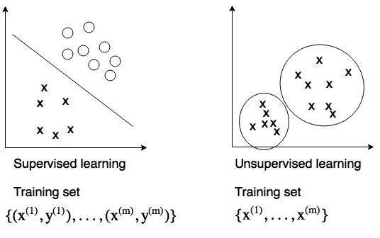
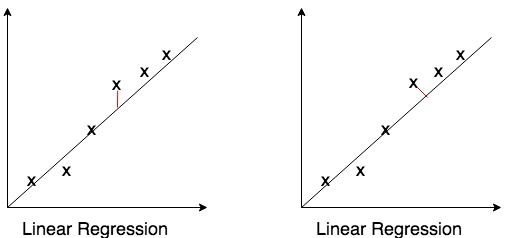

## Week 8
1. Clustering
    * Unsupervised learning

        * Applications: *market segmentation*, *social network analysis*, *organize computer cluster*, *astronomical data analysis*

        

    * K-means algorithm
        
        

        Input: K (number of clusters), Training set {x(1), ..., x(m)}, where x(i) &isin; Rn(drop x0 = 1 as convention)

        **Randomly initialize K cluster centroids &mu;1, ..., &mu;K**

        **Repeat{**

        **for i = 1 to m**
        
        &nbsp;&nbsp;&nbsp;&nbsp;**C(i) = index (from 1 to K) of cluster cnetroid closest to x(i)** &larr; *Cluster assignment step*

        **for k = 1 to K**

        &nbsp;&nbsp;&nbsp;&nbsp;**&mu;k = average of points assigned to cluster k** &larr; *Move centroid step*

        **}**

        * *Note: if no sample assigned to a centroid, we can*

            1. *Delete that centroid, and decrease the number of centroids to K-1 (more common).*
    
            2. *Randomly reinitialize the centroid if need K clusters.*

    * K-means for non-separated clusters

        

        Even though in some cases, the date seems not separated, we can still use clustering to group them. In the case above, we divide the points into 3 clusters by their weight and height.

    * Optimization objective

        Define &mu;c(i) = cluster centroid of cluster to which example x(i) has been assigned, e.g. x(i) &rarr; 5, c(i) = 5, &mu;c(i) = &mu;5

        Define our distortion cost function as :

        

    * Revisit the algorithm
        
        * The cluster assignment step is to minimize J(...) with respect to C(1), ..., C(m), while holding &mu;1, ..., &mu;K fixed
        * The move centroid step is to minimize J(...) with respect to &mu;1, ..., &mu;K

    * Random Initialization
       
        Randomly pick K (K < m) traning examples and set &mu;1, ..., &mu;K to these K examples. 

    * Local optima: try initializing several different times

        
        
        for i = 1 to test_numbers (50-1000 is reasonable){

        &nbsp;&nbsp;&nbsp;&nbsp;*Randomly initialize K centroids*

        &nbsp;&nbsp;&nbsp;&nbsp;*Run k-means, get C(1), ..., C(m), &mu;1, ..., &mu;K*

        &nbsp;&nbsp;&nbsp;&nbsp;*Compute cost function J(...)*

        }

        **Pick clustering that gives lowest cost function J(...)**

        * K = 2-10, random initialization works pretty well

        * K >> 10, just slight improve after random initialization

    * Choosing the number of clusters: 

        * Mainly by hand, human judgement
            
            

        * Elbow method: plot cost function vs. K

            

            "Worth a shot, but won't have a high expectation", because many times, there are no clear elbow.

        * Later/downstream purpose

            e.g. T-shirt sizing: K = 3 &rarr; S, M, L; K = 5 &rarr; XS, S, M, L, XL

2. Dimensionality Reduction
    * Motivation
        * Data compression
            
            

            Reduce data from 2D to 1D if datas fall near a line, or reduce data from 3D to 2D if data falls near a plane, etc.

        * Data visualization

            Suppose we have a table like this:

            Country|GDP (x1)| Per capita GDP (x2)|...|x50
            --|--|--|--|--
            Canada|...|...|...|...
            China|...|...|...|...
            ...|...|...|...|...

            We can reduce x &isin; R50 &rarr; z &isin; R2

            
    * Principle Component Analysis problem formulation

        Reduce from n-dimension to K-dimension:

        Find K vectors u(1), ..., u(K) onto which to project the data, so as to minimize the projection error.

    * PCA is not linear regression

        **Linear regression minimizes vetical distances, while PCA minimizes orthogonal distances, where data is not labeled and treated equally**

        

    * PCA algorithm

        *Preprocessing, feature scaling*
        
        Reduce data from n-d to K-d

        *Compute ["Covariance matrix"](https://en.wikipedia.org/wiki/Covariance_matrix), which is a way to represent the linear relationship between variables:**
        
        &nbsp;&nbsp;&nbsp;&nbsp;

        *Compute "eigenvectors" of matrix &sum; using [Singular-value decomposition](https://en.wikipedia.org/wiki/Singular-value_decomposition)*
            
        &nbsp;&nbsp;&nbsp;&nbsp;[U, S, V] = svd(&sum;)

        *Select first eigenvectors as Ureduce = U(:, 1:K), and compute the projection of x to z by inner product:
        &nbsp;&nbsp;&nbsp;&nbsp;z = (Ureduce)T&sdot;x, where z &isin; RK*

    * Vectorized implementation and summary
        
        **After mean normalization and feature scaling**

        **&sum; = 1&frasl;m&sdot;XT&sdot;X**

        **[U, S, V] = svd(&sum;)**

        **Ureduce = U(:, 1:K)**

        **Z = X&sdot;Ureduce**

    * Reconstruction from compressed representation

        xapprox = Ureduce&sdot;z 

        Vectorized: **Xapprox = Z&sdot;Ureduce**

    * Choose the number of pricinple components

        Average squared projection error:

        &nbsp;&nbsp;&nbsp;&nbsp;

        Total variation in the data:
    
        &nbsp;&nbsp;&nbsp;&nbsp;

        Typically, choose K to be the smallest value, so that

        &nbsp;&nbsp;&nbsp;&nbsp;

        or **"99% of variance is retained"**

    * Choose K algorithm:
        
        **Try PCA with K = 1, 2, ...**

        **Compute [U, S, V] = svd(&sum;)**

        **Pick the smallest K that satisfies:**
            
        &nbsp;&nbsp;&nbsp;&nbsp;

    * Application of PCA:
        
        * Speed up supervised learning

            *Note: mapping x(i) &rarr; z(i) should be defined by training PCA only on the training set. This mapping can be applied to xcv(i) and xtest(i)*

        * Reduce memory/disk needed to store data
        * Visualization: K = 2 or 3

    * Bad use of PCA:

        * Prevent overfitting: it might work ok, but isn't a good because PCA will throw away some data without knowing y. Use regularization instead.
        * Blindly use PCA in ML system: before implementing PCA, first try to run with original data. Only if that doesn't do what you want, then consider implementing PCA.
