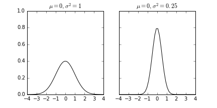

## Week 9
1. Anomaly Detection
    * Motivation

        Aircraft engine checks

        

    * Density estimation
        
        Given dataset {x1, ..., x1), is xtest anomalous?

        Model p(x):

        p(xtest) < &epsilon; &rarr; anomaly

        p(xtest) &ge; &epsilon; &rarr; OK

        

    * Examples
        
        * Fraud detection
        * Manufacturing
        * Monitoring computers in a data center

    * Gaussian Distribution
        
        * Say x &isin; R, if x is distributed Gaussian with mean &mu; and variance &sigma;2

            x ~ N(&mu;, &sigma;2)

            

        * Examples with different &mu; and &sigma;

            

        * Parameter estimation

            

            
        
        * Anomaly detection algorithm

            Choose features xi taht you think might be indicative of anomalous examples

            Fit parameters &mu;1, ..., &mu;n, &sigma;12, ..., &sigma;n2

            Given new example x, compute p(x):

            &nbsp;&nbsp;&nbsp;&nbsp;

            Anomaly if p(x) < &epsilon;

2. Building an anomaly detection system
    * Aircraft engines motivating example
        
        Assume that we have 10000 good engines and 20 flawed engines, we could build the detection system as :

        * Training set: 6000 good engines; Cross validation set: 2000 good engines and 10 anomalous ones; Test set: 2000 good engines and 10 anomalous ones

        * Alternatively even though not recommended by Andrew. Training set: 6000 good; CV: 4000+10; test set: 4000+10; Where same good engine examples or same anomalous engines were used for CV set and test set.

    * Algorithm evaluation:

        The data may be quite skewed, so we need additional evaluation metrics other than prediction accuracy

        * True positive, false positive, false negative and true negative
        * Precision and recall
        * F1-score

        The cross validation test can also be used to choose parameter &epsilon;

    * Anomaly Detection VS. Supervised Learning

        Anomaly Detection|Supervised Learning
        -|-
        Very small number of positive examples (0-20 is common) and large number of negative examples|Large number of positive and negative examples
        Contains many different types of anomalies, which are hard for any algorithm to learn from positive examples|Enough positive examples to get a sense of what examples are like
        Future anomalies may not look like any anomalies seen before|Future positive anomalies likely to be similar to ones in training set
        * Application
            
            Anomaly Detection|Supervised Learning
            -|-
            Fraud Detection|Email spam
            Manufacturing|Weather prediction
            Monitoring machines in data center|cancer classification

            We may swithc from anomaliy detection to supervised learning when enough examples were given.

    * Features to use

        * Non-Gaussian features

            Sometimes the histogram of training set does not look like Gaussian distributed we may try to "correct" it by applying additional functions, such as *log(x+c)*, *xc*, ...

            

        * Error analysis

            Want p(x) large for normal and small for anomalous

            Most common problem: p(x) is comparable for normal and anomalous:

            **Look at examples that are close to cutoff and create new features**

            

        * Monitoring computers in a data center

            Chose features that are unusually large or small in the event of an anomaly

            x1 = memory use

            x2 = number of disk accesses

            x3 = cpu load

            x4 = network traffic

            x5 = x3/x4

            ...
3. Multivariate Gaussian Distribution
    * Motivation
        
        
        
        *The anomaly looks not so bad on both plots, but fails to predict*

        Instead of model p(xi) separately, model p(x) all in one go.

    * Parameters
        
        

        

        The distribution will change with respect to &mu; (location of center) and &sum; (the shape of distribution)

        

        And p(x) is given by

        

        If p(x) < &epsilon; flag an anomaly.

    * Original model is just a special case of multivariate Gaussian distribution

        

    * Comparision

        Original Model|Multivariate Gaussian
        -|-
        Manually create features to capture anomalies when features take unusual combinations|Automatically captures correlations between features
        Computationally cheaper, n can go large (10,000 to 100,000)|Computationally more expensive because of the calculation of the reverse of &sum;
        Ok if m is small|Must have m > n, otherwise &sum; is non-invertible (may also be resulted from redundant features)
        
