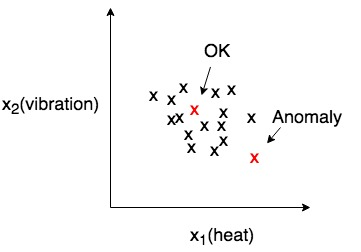
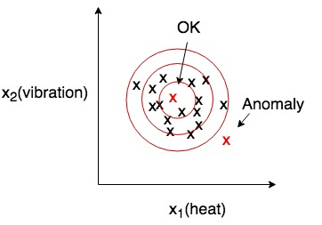
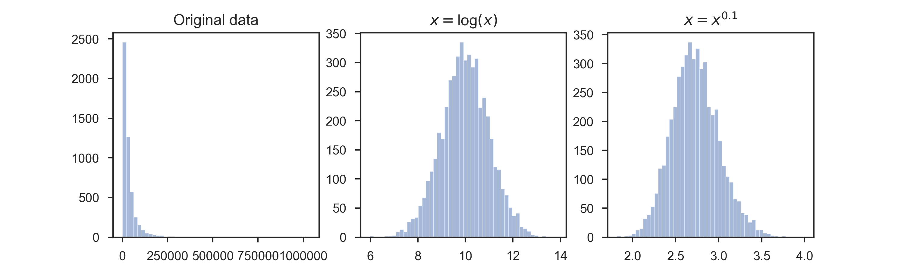
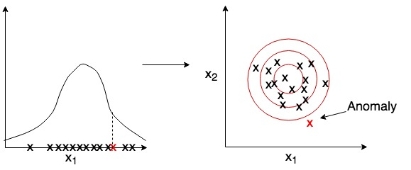
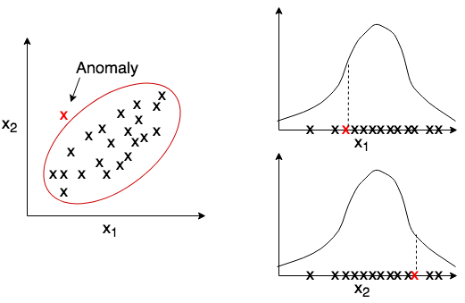
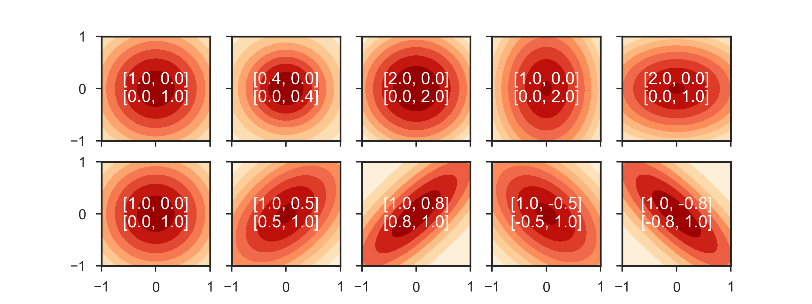

## Week 9
1. Anomaly Detection
    * Motivation

        Aircraft engine checks

        

    * Density estimation
        
        Given dataset {x(1), ..., x(m)), is xtest anomalous?

        Model p(x):

        p(xtest) < &epsilon; &rarr; anomaly

        p(xtest) &ge; &epsilon; &rarr; OK

        

    * Examples
        
        * Fraud detection
        * Manufacturing
        * Monitoring computers in a data center

    * Gaussian Distribution
        
        * Say x &isin; R, if x is distributed Gaussian with mean &mu; and variance &sigma;2

            x ~ N(&mu;, &sigma;2)

            

        * Examples with different &mu; and &sigma;

            

        * Parameter estimation

            

            
        
        * Anomaly detection algorithm

            Choose features xi that you think might be indicative of anomalous examples

            Fit parameters &mu;1, ..., &mu;n, &sigma;12, ..., &sigma;n2

            Given new example x, compute p(x):

            &nbsp;&nbsp;&nbsp;&nbsp;

            Anomaly if p(x) < &epsilon;

2. Building an anomaly detection system
    * Aircraft engines motivating example
        
        Assume that we have 10000 good engines and 20 flawed engines, we could build the detection system as :

        * Training set: 6000 good engines; Cross validation set: 2000 good engines and 10 anomalous ones; Test set: 2000 good engines and 10 anomalous ones

        * Alternatively even though not recommended by Andrew. Training set: 6000 good; CV: 4000+10; test set: 4000+10; Where same good engine examples or same anomalous engines were used for CV set and test set.

    * Algorithm evaluation:

        The data may be quite skewed, so we need additional evaluation metrics other than prediction accuracy

        * True positive, false positive, false negative and true negative
        * Precision and recall
        * F1-score

        The cross validation test can also be used to choose parameter &epsilon;

    * Anomaly Detection VS. Supervised Learning

        Anomaly Detection|Supervised Learning
        -|-
        Very small number of positive examples (0-20 is common) and large number of negative examples|Large number of positive and negative examples
        Contains many different types of anomalies, which are hard for any algorithm to learn from positive examples|Enough positive examples to get a sense of what examples are like
        Future anomalies may not look like any anomalies seen before|Future positive anomalies likely to be similar to ones in training set
        * Application
            
            Anomaly Detection|Supervised Learning
            -|-
            Fraud Detection|Email spam
            Manufacturing|Weather prediction
            Monitoring machines in data center|cancer classification

            We may switch from anomaly detection to supervised learning when enough examples were given.

    * Features to use

        * Non-Gaussian features

            Sometimes the histogram of training set does not look like Gaussian distributed. Even though the model probablity works fine, but we may try to "correct" it by applying additional functions, such as *log(x+c)*, *xc*, ...

            

        * Error analysis

            Want p(x) large for normal and small for anomalous

            Most common problem: p(x) is comparable for normal and anomalous:

            **Look at examples that are close to cutoff and create new features**

            

        * Monitoring computers in a data center

            Chose features that are unusually large or small in the event of an anomaly

            x1 = memory use

            x2 = number of disk accesses

            x3 = cpu load

            x4 = network traffic

            x5 = x3/x4

            ...
3. Multivariate Gaussian Distribution
    * Motivation
        
        
        
        *The anomaly looks not so bad on both plots, but fails to predict*

        Instead of model p(xi) separately, model p(x) all in one go.

    * Parameters
        
        

        

        The distribution will change with respect to &mu; (location of center) and &sum; (the shape of distribution)

        

        And p(x) is given by

        

        If p(x) < &epsilon; flag an anomaly.

    * Original model is just a special case of multivariate Gaussian distribution

        

    * Comparision

        Original Model|Multivariate Gaussian
        -|-
        Manually create features to capture anomalies when features take unusual combinations|Automatically captures correlations between features
        Computationally cheaper, n can go large (10,000 to 100,000)|Computationally more expensive because of the calculation of the reverse of &sum;
        Ok if m is small|Must have m > n, otherwise &sum; is non-invertible (may also be resulted from redundant features)
        
        Andrew's experience suggests when m > 10n, we could try Multivariate Gaussian

4. Recommender System        

    * Example: Predict Movie Rating, from 0 to 5 stars

        Movie|Alice(1)|Bob(2)|Carol(3)|Dave(4)
        -|-|-|-|-
        movie 1|5|5|0|0
        movie 2|5|?|?|?
        movie 3|?|4|0|4
        movie 4|0|0|5|?

        nu = no. of users

        nm = no. of movies

        r(i, j) = 1 if user j has rated movie i

        y(i, j) = rating given by user j to movie i (defined only if r(i, j) = 1)
    
    * Content Based Recommendations

        Build feature vectors x(1), ..., x(nm)

        For each user j, learn parameters &theta;(j) &isin; Rn and predict user j's rating on movie i with (&theta;(j))T&sdot;x(i) stars

        * Problem formulation

            To learn &theta;(j)

            &nbsp;&nbsp;&nbsp;&nbsp;

            Get rid of m(j) and learn all &theta;:

            &nbsp;&nbsp;&nbsp;&nbsp;

            Gradient descent update:

            For k &ne; 0:

            &nbsp;&nbsp;&nbsp;&nbsp;
            
            For k = 0:
            
            &nbsp;&nbsp;&nbsp;&nbsp;

    * Collaborative Filtering

        Given x(1), ..., x(nm), we can estimate &theta;(1), ..., &theta;(nu)

        Given &theta;(1), ..., &theta;(nu), we can estimate x(1), ..., x(nm)

        We can actually optimize both simutaneously and cost function is
        
        

    * Algorithm

        **Initialize x(1), ..., x(nm) and &theta;(1), ..., &theta;(nu) to small random values**

        **Minimize J(...) using gradient descent (or other methods):**

        &nbsp;&nbsp;&nbsp;&nbsp;

        &nbsp;&nbsp;&nbsp;&nbsp;

        **For a user with parameter &theta; and a movie with feature x, pridict rating by &theta;Tx**

    * Low Rank Matrix Factorization

        Define:

        &nbsp;&nbsp;&nbsp;&nbsp;
        &nbsp;&nbsp;&nbsp;&nbsp;

        Predicted rating = X&Theta;T &rarr; [Low Rank Matrix](https://en.wikipedia.org/wiki/Low-rank_approximation)

    * Finding related movies

        How to find movie j related to movie i?

        **if ||x(i)-x(j)|| is smaller &rarr; movie i and j are "similar"**

    * Mean normalilzation

        If we add a new user with no rating at all, then because of the regularization terms in our cost function, &theta; will be 0 for all features, which means &theta;Tx is also 0, and all movies will assign 0 stars.
        
        To avoid such scenario, we first calculate the means for each movie and subtract each rating with the mean and then use the algorithm to learn. e.g.
    
         &rarr;   &rarr;  

        And for new user j that gave no rating, we will predict (&theta;(j))T&sdot;x(i)+&mu;i = &mu;i
